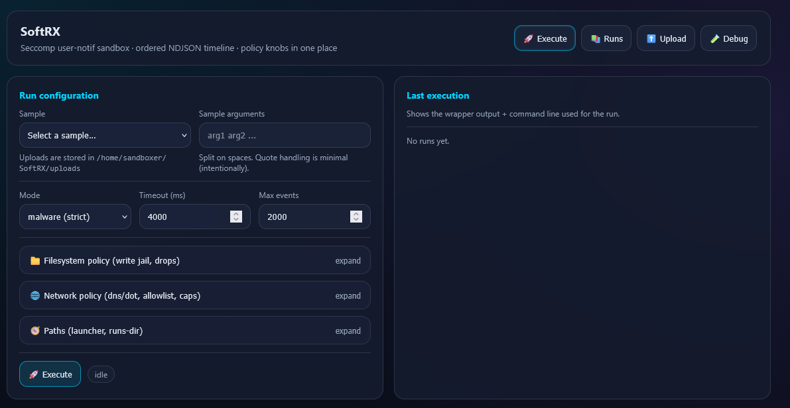
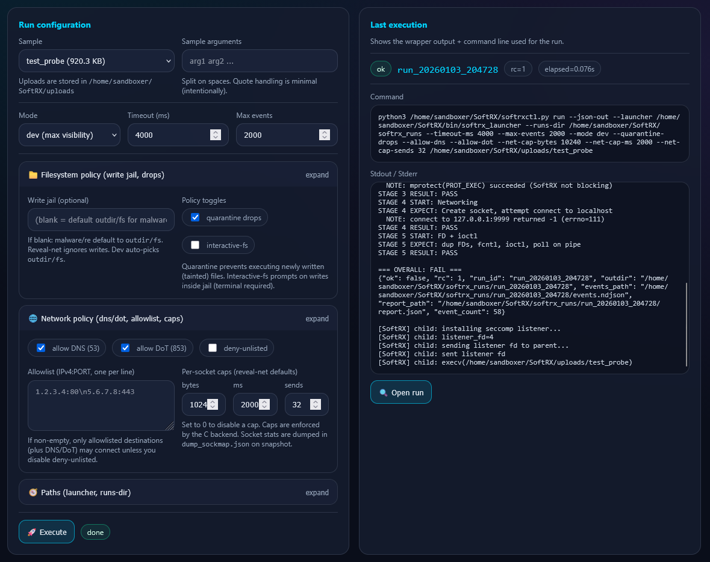
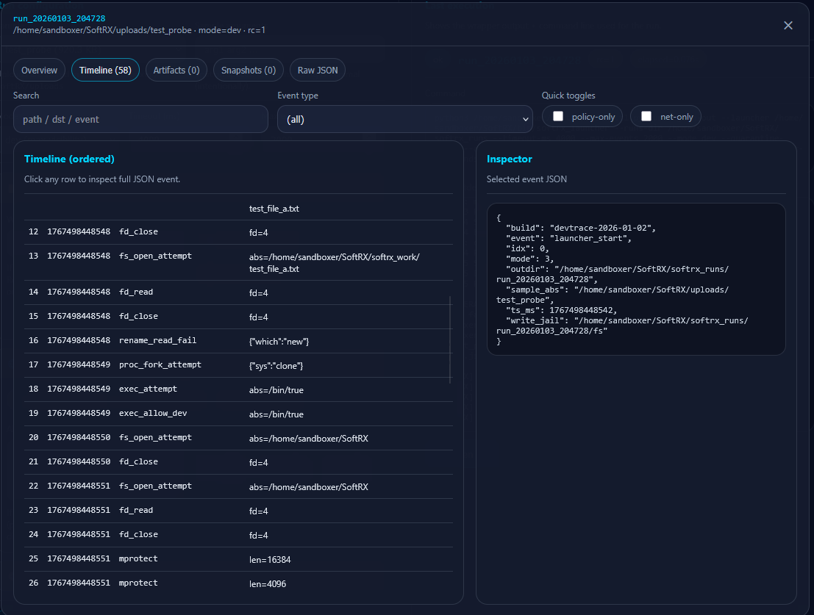

# SoftRX

**SoftRX** is a focused runtime-revelation laboratory for unpacking, observing, and extracting intent from opaque binaries *without ever allowing execution to complete or cause harm*.

SoftRX was born out of real-world malware research where traditional static analysis and generic sandboxes failed. Instead of trying to *understand everything*, SoftRX is designed to let binaries **betray themselves** — just long enough to expose their payloads, strings, and operational intent.



---

## Philosophy

> *Execution is allowed only long enough to reveal intent.  
> Completion is never allowed.*

SoftRX is **not**:
- a malware sandbox
- an emulator farm
- a behavioral AV engine
- an exploitation framework

SoftRX **is**:
- a runtime unpacking lab
- a syscall-semantic instrument
- a memory revelation engine
- a research-grade artifact extractor

---

## What SoftRX Does

SoftRX automates and instruments the exact workflow analysts often perform manually:

1. **Classify** an unknown binary (architecture, packing signals, entropy)
2. **Launch** it in a tightly constrained runtime
3. **Intercept** semantic syscalls (`mprotect`, `fork`, `execve`, etc.)
4. **Pause** execution at critical transitions (RW→RX, fork divergence)
5. **Dump** only the memory that matters (anonymous executable regions)
6. **Extract** strings, indicators, and artifacts
7. **Report** findings in structured, disclosure-ready form

At no point is the sample allowed to:
- reach the real network
- persist on disk
- delete files
- execute secondary payloads
- complete its lifecycle

--- 
Toggle different variations of permissions to change the runtime behavior and expose/prevent execution
from doing specific syscalls etc. 



After execution, examine the run in detail to see what the software did: 



---

## Core Design Principles

- **Outcome sandboxing, not behavior sandboxing**
- **Semantic breakpoints, not instruction stepping**
- **Memory truth over static illusion**
- **User-in-the-loop analysis**
- **Architecture-agnostic where possible**

---

## Architecture Overview

```
SoftRX/
│
├── softrxctl.py        # CLI entrypoint
│
├── core/
│   ├── classifier.py  # Static recon & execution planning
│   ├── launcher.c     # Seccomp-based controlled launch
│   ├── sysmon.c       # Syscall semantic interception
│   ├── memdump.py     # Targeted memory dumping
│   ├── artifacts.py  # Strings & indicator extraction
│   └── report.py     # Structured output generation
│
├── debug/
│   ├── gdb_bridge.py  # Optional GDB/QEMU integration
│   └── mi_parse.py
│
├── web/
│   └── app.py        # Flask-based operator console
│
└── policies/
    ├── seccomp_policy.h
    ├── fs_policy.json
    └── net_policy.json
```

---


## Execution Phases

### Phase 0 — Static Recon
- ELF headers
- architecture detection
- packing signals (UPX, entropy, missing sections)

### Phase 1 — Controlled Launch
- seccomp-based syscall gating
- no real network access
- tightly limited filesystem interaction

### Phase 2 — Runtime Interception
- semantic syscall hooks:
  - `mprotect` (RW→RX)
  - `fork` / `clone`
  - `execve`
  - `/proc/self/exe` access
- execution pauses on meaning, not time

### Phase 3 — Memory Revelation
- dump anonymous RX regions
- dump executable heap
- tag dumps with triggering events

### Phase 4 — Artifact Extraction
- protocol strings
- persistence attempts
- credential lists
- device fingerprints
- command templates

### Phase 5 — Reporting
- JSON (machine-readable)
- Markdown (human-readable)
- VirusTotal-ready artifacts

---

## Safety Guarantees

SoftRX enforces the following invariants:

- Network syscalls are logged but never succeed
- File creation and execution are mutually exclusive
- Destructive filesystem operations are denied
- Fork/clone/vfork-based evasion is tracked and neutralized (first attempt is logged, then the sample is killed)
- Execution is forcibly halted after artifact capture

---

## Intended Use

SoftRX is designed for:
- malware researchers
- threat intelligence analysts
- reverse engineers
- academic study
- responsible disclosure workflows

It is **not intended** for:
- mass automation
- exploitation
- botnet research beyond artifact extraction
- running malware at scale

---

## Quickstart

Build the launcher:

```bash
make
```

Run a single sample:

```bash
python3 softrxctl.py ./sample.bin --outdir softrx_runs --timeout-ms 4000 --max-events 8
```

Batch-run a directory of samples (writes an NDJSON index alongside the run folders):

```bash
python3 tools/batch_orchestrator.py ./samples --outdir softrx_runs --jobs 4 --timeout-ms 4000 --max-events 8
```

Notes:
- Filesystem mutation attempts are logged with high-fidelity arguments (paths/flags) and denied.
- Fork/clone/vfork are logged and immediately neutralized.

---

## Status

SoftRX is an **active research tool** under construction.

The initial milestone focuses on:
- RW→RX detection
- memory dumping
- artifact extraction
- structured reporting

Everything else is iterative.

---

## Ethos

SoftRX exists to make opaque systems legible.

It favors:
- clarity over completeness
- evidence over speculation
- restraint over power

---

## License

TBD (recommend permissive license with ethical use clause).

---

*SoftRX — Reveal the payload, not the damage.*
